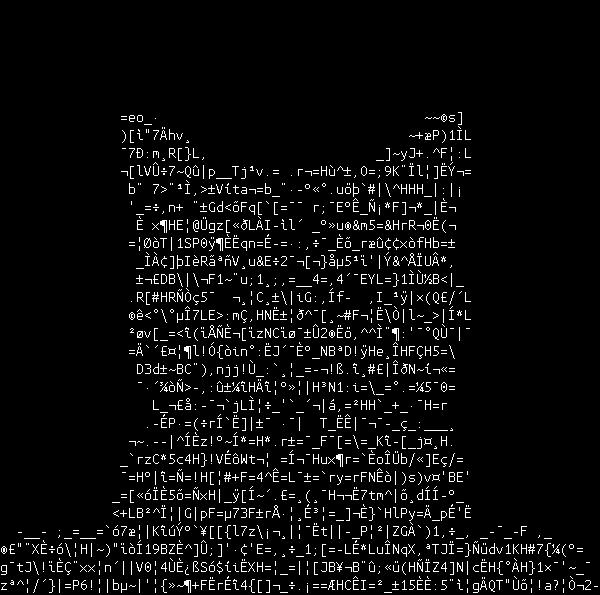

# Image to ASCII converter

A converter that converts image to ascii

# Examples

## [Video Example](https://youtu.be/a9YV8RVLkLo)

 

 

# Setup

Install all the dependencies  
Download a font to put into the fonts folder

# To convert single Image

`python main.py scale input_image output_image`

# To convert video to ASCII

Modify the `file_name` in `dump_video.py` and run to get the video in image sequence

Modify `video.py` to specify how many threads you'll use the run it

Run `ffmpeg -framerate 30 -i ./ascii_dump/%d.png output.mp4` to combine the images into mp4
